## Crack The Hash 

###### Can you complete the level 1 tasks by cracking the hashes?

###### This repository is dedicated to show how i go through Hacking challenges.

###### Created only for learning pourposes and all the solutions and tricks are used at controlled environments.

### Happy Hacking Phreaks 😃


Can you complete the level 1 tasks by cracking the hashes?


  # Hash 01 ⬇️
  
  ````
  48bb6e862e54f2a795ffc4e541caed4d
  ```` 
  - You need to find out what of hash you're dealing with to know what method you'll gonna use to crack it.
  - So for this first hash i'll be using "Hash Identifier"
  - You can check out more information about this tool here 🔜  [Hash Identifier](https://www.kali.org/tools/hash-identifier/)
    
    
  
  - You can type this in your terminal:
  
    ````
    hash-identifier
    ````
  - Now you paste your hash and the output should be somethin like this:
    
    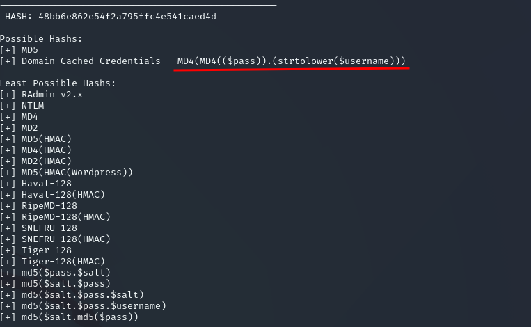
  
  - So now you know what type of password you're cracking!!!!
  - Now let's jump into "Jhon The Reaper" tool which is my choice this time
  - If don't know this tool yet you can take a look at the docs clicking here 🔜  [John The Reaper](https://www.openwall.com/john/)
  - First you send your hash to a file just like this:
   
    ````
    echo "48bb6e862e54f2a795ffc4e541caed4d" > hash_01.txt           
    ````
  - The command for john is the following:
   
    ````
    john --format=raw-md5 --wordlist=~/Downloads/rockyou.txt hash_01.txt
    ````
  - Now you should see some output like this one:

    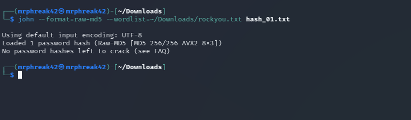
  
  - Second command to see the hash this time is:
       
    ````
    john --show --format=raw-md5 hash_01.txt     
    ````
  
  - And there is the cracked password:

    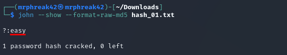
  
  - Our job is done for this one:

    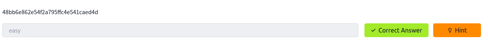
  

 # Hash 02 ⬇️
  
  ````
  CBFDAC6008F9CAB4083784CBD1874F76618D2A97
  ```` 
  - Let's do the same with this one:

    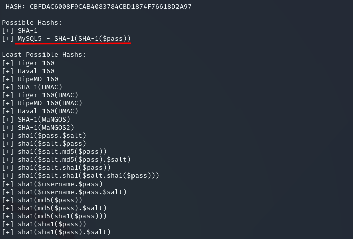
  
  - Send the hash to a ".txt" file:
  
    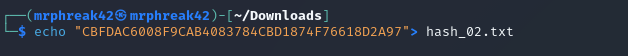

  
  - Crack the hash using Jhon:
  
    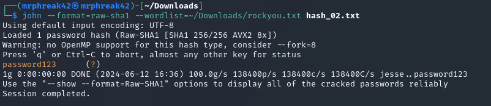

  
  - There it is:
  
    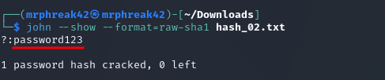

  - And that's all for the second hash:  
    
    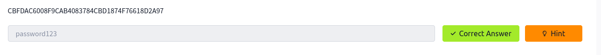
  

 # Hash 03 ⬇️
  
  ````
  1C8BFE8F801D79745C4631D09FFF36C82AA37FC4CCE4FC946683D7B336B63032
  ```` 
- Let's do the same with this one:

    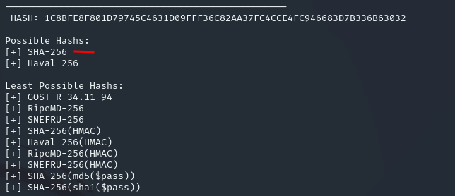
  
- Send the hash to a ".txt" file:

  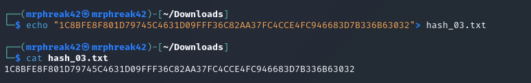


- Crack the hash using Jhon:

  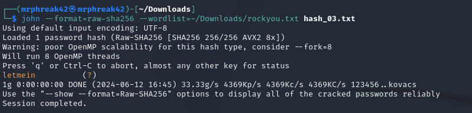


- There it is:

  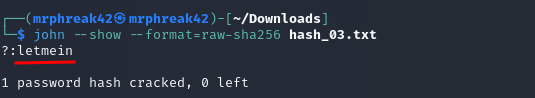

  
- Our job is done for this one too:

  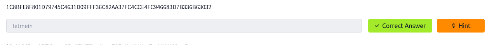

# Hash 04 ⬇️
  
  ````
  $2y$12$Dwt1BZj6pcyc3Dy1FWZ5ieeUznr71EeNkJkUlypTsgbX1H68wsRom
  ```` 
- If you try to run this against the hash-identifier you'll not get the type of hash
- So you can go to the [HashCat Website](https://hashcat.net/wiki/doku.php?id=example_hashes)
- There's a list of hash types so you can a take a look and find out more information about 
  
  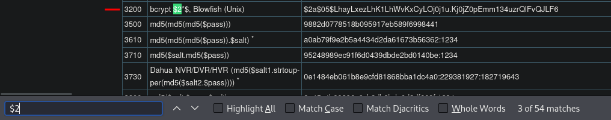

- Bcrypt hashes are hard to crack because it takes patience by the attacker
- So, in this case you'll be using "hashcat" for cracking
- As may noticed, the image above has a number (3200)
- Each hash hash its "code mode" so for bcrypt hashes we'll use "3200"
  
  ````
  hashcat -m 3200 <your_hash.txt> path/to/your/wordlists/rockyou.txt
  ````   
  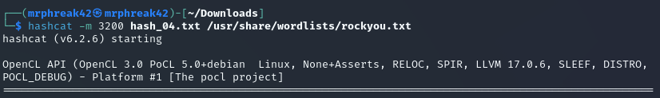

  ##### Now you may go and take some coffee because its taking a very long time depending on your machine setup ☕

- When it gets finished... if are not seeing your hash run this command ⬇️
  
  ````
  hashcat -m 3200 <your_hash.txt> path/to/your/wordlists/rockyou.txt --show
  ````   
  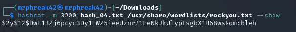

- And we're done for this one:
  
  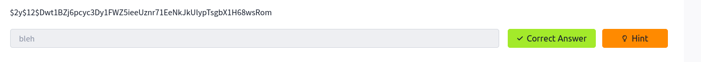


<!-- # Hash 05 ⬇️
  
  ````
  279412f945939ba78ce0758d3fd83daa
  ```` 
- Let's try to identify this one:

    
  
- Sometimes hash-identifier might be a little tricky, but don't worry, a bit of patient, research and experience you'll know what you're dealing with
- So for this case we know that is a md4 hash
- And just like the previous ones we're sending it to a ".txt" file so our work gets easier

  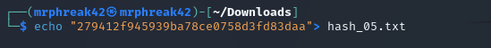


- If you did look at [HashCat Website](https://hashcat.net/wiki/doku.php?id=example_hashes) should know by now that our mode to the this crack is 900, right?
  
  ````
  hashcat -m 900 <your_hash.txt> path/to/your/wordlists/rockyou.txt
  ````   
  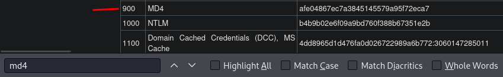
  
  - Wanna use John The Reaper for this one? No problem ⬇️
  
  ````
  john --format=raw-md4 --wordlist=path/to/your/wordlists/rockyou.txt <your_hash.txt>
  ````    -->


  # Hash 05 ⬇️
    
  ````
  F09EDCB1FCEFC6DFB23DC3505A882655FF77375ED8AA2D1C13F640FCCC2D0C85
  ```` 

  - So as you may the workflow is almost the same as previous ones so let's get straight to the point
  
  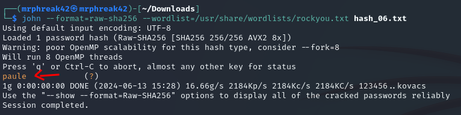

  - And there it is:
  
  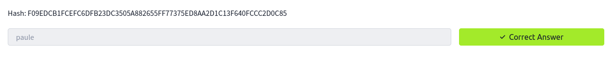
  


  <!-- # Hash 07 ⬇️
  
  ````
  1DFECA0C002AE40B8619ECF94819CC1B
  ````     -->